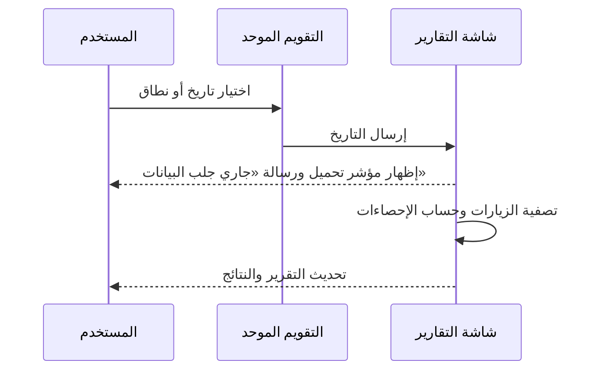

# شرح بصري لخصائص التقارير

## 1) التصفية حسب نطاق زمني

```mermaid
flowchart LR
  A[فتح شاشة التقارير] --> B[اختيار من تاريخ]
  B --> C[اختيار إلى تاريخ]
  C --> D[الضغط على تطبيق / بحث]
  D --> E[عرض الزيارات داخل الفترة فقط]
  E --> F[طباعة أو تصدير PDF / Excel]
```

## 2) تأثير التحميل بعد اختيار التاريخ

```mermaid
sequenceDiagram
  participant U as المستخدم
  participant C as التقويم الموحد
  participant R as شاشة التقارير
  U->>C: اختيار تاريخ أو نطاق
  C->>R: إرسال التاريخ
  R-->>U: إظهار مؤشر تحميل ورسالة «جاري جلب البيانات»
  R->>R: تصفية الزيارات وحساب الإحصاءات
  R-->>U: تحديث التقرير والنتائج
```
